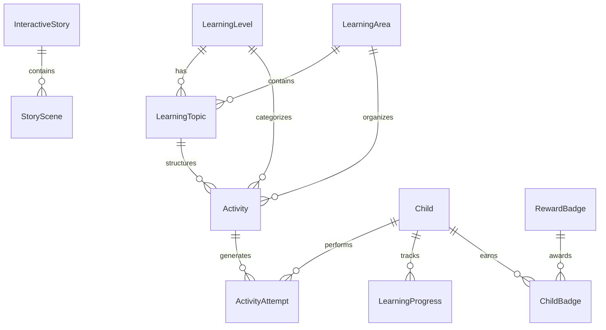

# Learning Content & Data Model

This document outlines the entity relationships and JSON schemas powering EduKadence's Phase 3 learning content catalog.

---

## 1. Relational Entity Hierarchy

---

## 2. Publication States

Every activity adheres to explicit lifecycle states:
- `DRAFT`: Visible only to school admin / curriculum developers. Never exposed in Kid Mode.
- `PUBLISHED`: Verified and visible to children matching the developmental level.
- `ARCHIVED`: Historical activity no longer listed in active catalogs but preserving past attempt records.
